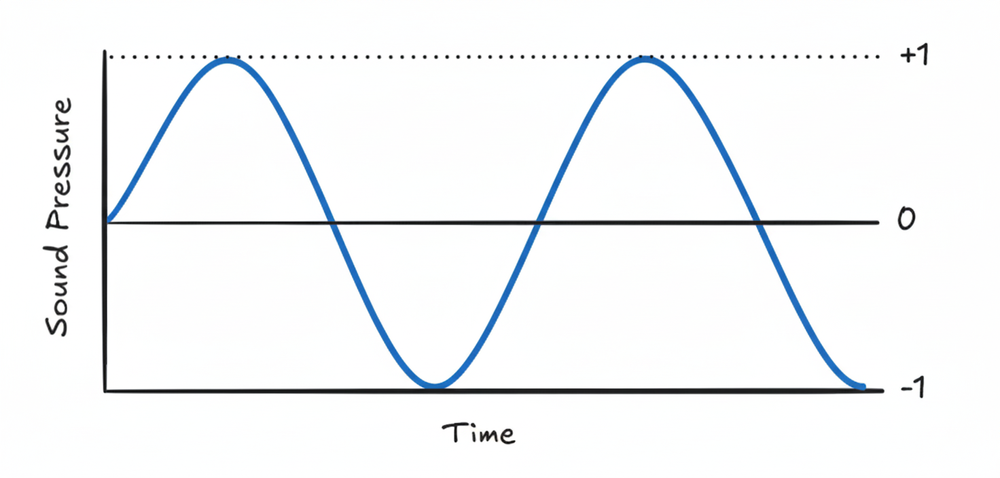

# Physics Behind Sound For Better Understanding

## Abstract
**Voice Emotion Detector**, I decided to work with this project as I thought this would help me inteigrate it in my future projects. *I have this one project*.

How this would work is I would train a model with the Ravdess data set to identify multiple emotions and it'll detect your emotion and based on that it'll return your current mood, This can be used for mental health analysis which we could use in a LLM to make it more aware of your current state.

### Future Project Description
An **AI Journal**, How would this work ? An AI journal would be a place where you journal about your day and later a LLM summarizes the stuff, Provides you with with the stuff that you did well, what could you have done better and more. It would be instructed to be a friendly and human like AI Bot so you can have conversations about **You** on the main window. *It would be a like a chat window where you talk to it like someone that knows your roots*.

---

## How Audio Data/Audio/Sound works

In this part I'll cover the research I've done on how sound actually works.
Sound is basically the vibration that travels as a form of wave through a **medium** (*air, water, solid*). These vibrations are a form of energy that causes the particles to compress and decompress (Also known as refration) creating a wave that is later interpreted by the brain. 

Two types of waves: 
1. Mechanical Wave -> Needs a medium 
2. Longitudinal Wave -> A type of **mechanical wave** where **particles** move back and forth in the same direction as the wave creating a region of **compression** and **refraction**

[Image Source](https://www.soundproofingcompany.com/soundproofing_101/what-is-sound)

[Link where the image is taken from](https://www.soundproofingcompany.com/soundproofing_101/what-is-sound)

- Compression is the region of **high** pressure where the particles are **tightly packed**
- Refraction is the region of **low** pressure where the particles are **losely packed**

*All longitudinal waves are mechanical waves, but not all mechanical waves are longitudinal   *
*Sound mainly uses longitudinal waves*

**FunFact: A Human is capable of hearing 20HZ to 20,000HZ. Anything below 20HZ is called subsonic and above 20,000 is called ultrasonic sound**

## Properties of wave

### A Diagram of wave

### Amplitude

- We can understand Amplitude with a example of rope.
When we disturb a rope it forms waves, originally the rope was at rest a straight line (*Zero line in the [wave diagram](#a-diagram-of-wave)*) the rope goes higher and lower depending on the force applied   The space between the rest position of the rope and the crest (The high point) of the rope is what Amplitude is!!

- Amplitude is basically the distance between the crest and the rest position of the wave. Amplitude and Loudness go in hand in hand, more the amplitude the more the loudness

[Image Source](https://primaryscienceonline.org.uk/glossary-of-terms/amplitude/)

*Image from (https://primaryscienceonline.org.uk/glossary-of-terms/amplitude/)*

[Article Read](https://www.physicsclassroom.com/class/waves/lesson-2/the-anatomy-of-a-wave)

### Frequency

Frequency is basically the number of times a sound wave repeats itself, It's measured in hertz.

- High Frequency is when the wave repeats faster in a single second (Less gap between each wave) (Has a shorter wavelength)

- Low Frequency is when the wave repeats slower in a single second (More gap between each wave)(Has a longer wavelength)

[Image Source](https://uvicaudio.wordpress.com/2014/10/29/frequency-filtering/)

[Frequency Artile](https://uvicaudio.wordpress.com/2014/10/29/frequency-filtering/)

### Wave length

A wave length can be defined as the length of a single wave cycle, we can observe 

*The wavelength is the distance from crest to crest (or from trough to trough)*

that the wave itself repeats a dosen of times. A wave cycle is basically when a wave goes from rest to 1 and then to -1 (refer to [wave diagram](#a-diagram-of-wave)*).

[Image Source](https://byjus.com/physics/characteristics-of-sound-wavesamplitude/)

[Video Referred For Wave Cycle](https://youtu.be/m_Uz1rGo5l4)

[Diagram by Byjus](https://byjus.com/physics/characteristics-of-sound-wavesamplitude/)

[Refered Video: Audio Basics: Amplitude, Frequency & Wavelength](https://youtu.be/oswC6HiqHjM)

[Image Source](https://www.tremblingsandwarblings.com/2017/03/musical-sound-pitch-loudness/)

[Animation by Ralph T. Muehleisen](https://www.tremblingsandwarblings.com/2017/03/musical-sound-pitch-loudness/)

